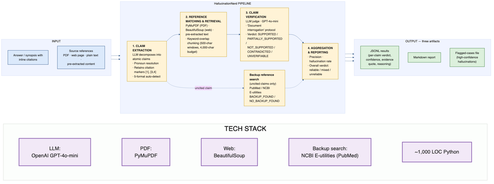

# HallucinationNerd

**A citation-level hallucination verification engine for synopsis-generating systems.**

HallucinationNerd checks whether cited sources actually support the claims attributed to them. Given any text with inline citations — a RAG synopsis, a research paper's Related Work, or an agentic system's report — it verifies each (claim, source) pair and returns per-claim verdicts with evidence pointers.



## Key Results

| Benchmark | Accuracy | Precision | Recall |
|-----------|----------|-----------|--------|
| ArXiv 40-paper (cross-topic swaps) | **97.3%** | 90.9% | 100% |
| ArXiv same-field hard negatives | **92.6%** | 96.0% | 88.9% |

Statistically significantly better than MiniCheck (p < 0.0001) and RAGAS (p = 0.0001) on identical test data.

## How It Works

1. **Claim Extraction** — Decomposes text into atomic, decontextualized claims with citation markers
2. **Reference Matching** — Retrieves source content (PDF, web, text) and finds relevant passages via keyword-overlap chunking
3. **Document Interrogation** — Asks the source document itself whether it supports the claim using a structured LLM judge
4. **Aggregation** — Produces per-claim verdicts, evidence quotes, and overall reliability scores

For uncited claims, the system searches PubMed for backup references (`--search-backup` mode).

## Installation

```bash
pip install -r requirements.txt
```

Optional, for PDF and web-page source support:
```bash
pip install pymupdf beautifulsoup4 requests
```

Requires an OpenAI API key in `.env`:
```
OPENAI_API_KEY=your-key-here
```

## Usage

```bash
# Verify citations in a document
python verify_hallucinations.py --input data.json --output-dir results/ --task citation

# Also search PubMed for uncited claims
python verify_hallucinations.py --input data.json --output-dir results/ --task citation --search-backup
```

## Input Format

```json
[
  {
    "question_id": "Q1",
    "question": "What was asked",
    "synopsis": "The answer with [1] citations to verify",
    "retrieved_articles": [
      {
        "id": "1",
        "title": "Source paper title",
        "content": "Full text of source...",
        "url": "https://...",
        "path": "/path/to/file.pdf"
      }
    ]
  }
]
```

Sources can be provided as pre-extracted text (`content`), URLs to fetch (`url`), or PDF/text file paths (`path`).

## Citation Formats Supported

The `arxiv_extractor.py` module auto-detects and extracts citations in:

- `(Author et al., 2020)` — parenthetical author-year
- `[1]`, `[2, 3]` — numbered brackets
- `[Author et al., 2020]` — bracketed author-year
- `Author et al. (2020)` — narrative author-year
- `(1)`, `(2, 3)` — parenthetical numbers

## Verdict Taxonomy

| Verdict | Meaning |
|---------|---------|
| `SUPPORTED` | Source directly states or logically implies the claim |
| `PARTIALLY_SUPPORTED` | Source discusses the topic; gist correct but specifics differ |
| `NOT_SUPPORTED` | Source does not contain information relevant to this claim |
| `CONTRADICTED` | Source explicitly states the opposite |
| `UNVERIFIABLE` | Source content unavailable |
| `BACKUP_FOUND` | No citation provided; PubMed search found supporting evidence |
| `NO_BACKUP_FOUND` | No citation provided; no supporting evidence found in PubMed |

## Benchmarking Against Other Systems

```bash
# Run the benchmark evaluation script
python benchmark_template.py
```

See `datasets/` for the test data used in our evaluations.

## Statistical Validation

```bash
# Permutation test (p-value)
python statistical_tests/Diff2MeanSig.py

# Bootstrap confidence interval
python statistical_tests/Diff2MeanConf.py
```

## Citation

If you use this work, please cite:

```
@article{wasu2026hallucinationnerd,
  title={HallucinationNerd: A Framework and Tool for Detecting Citation Hallucinations in Synopsis-Generating Systems},
  author={Wasu, Taranumpreet Kaur and Kashyap, Harsh and Chennur, Vishnu and Shasha, Dennis},
  year={2026}
}
```

## Authors

- **Taranumpreet Kaur Wasu** — Thapar Institute of Engineering and Technology, Patiala, India
- **Harsh Kashyap** — Thapar Institute of Engineering and Technology, Patiala, India
- **Vishnu Chennur** — Downingtown STEM Academy, Downingtown, PA, USA
- **Dennis Shasha** — Department of Computer Science, New York University, New York, USA
